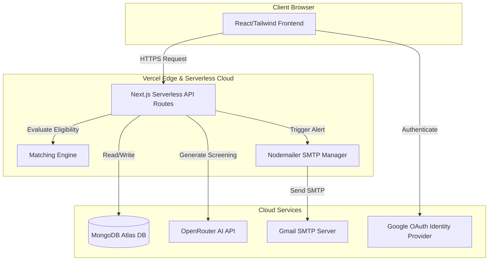

# 🏛️ RojgarMatch Deployment & Architecture Guide

This document provides a comprehensive technical overview of **RojgarMatch**, its full-stack architecture, database structures, and step-by-step production deployment instructions.

---

## 🛠️ Full-Stack Architecture

RojgarMatch is a **Next.js** unified full-stack application. It houses both the **Frontend UI** and the **Backend Server Engine** in a single, robust codebase.



### 1. The Frontend (React & TypeScript)
* **Pages & Routing**: Managed dynamically using Next.js **App Router** (`src/app/`).
* **Styling**: Built using **Tailwind CSS 4.0** with custom CSS utility classes.
* **State Management**: Built-in React hooks (`useState`, `useEffect`, `useMemo`) combined with NextAuth context.

### 2. The Backend (Next.js Serverless Routes)
* **API Endpoints**: Located in [src/app/api/](file:///c:/Users/sadiq/Desktop/GovRecruit/src/app/api/) containing route handlers for listings, profile screening, user listings, and sync parameters.
* **Matching Engine**: Evaluates applicant eligibility against job postings based on Course, Branch, and custom qualifiers ([src/lib/matching.ts](file:///c:/Users/sadiq/Desktop/GovRecruit/src/lib/matching.ts)).
* **AI Screening Server**: Communicates with AI models via **OpenRouter** to validate academic requirements, parse specifications, and generate standardized questions without exposing raw API keys.
* **Notification Server**: Operates in [src/lib/notification-service.ts](file:///c:/Users/sadiq/Desktop/GovRecruit/src/lib/notification-service.ts) using Nodemailer SMTP. It triggers automatically when new jobs are published, evaluating candidates against the matching engine and emailing matches.

---

## 🔑 Environment Variables Configuration

To run locally or in production, configure the following keys inside your `.env` file (local) or in your Vercel settings:

| Variable Name | Description | Example / Recommended Value |
| :--- | :--- | :--- |
| `MONGODB_URI` | Connection string to your cloud database. | `mongodb+srv://...` |
| `JWT_SECRET` | Secret key used to sign session cookies. | Any random alphanumeric string |
| `NEXTAUTH_SECRET` | Authentication key utilized by NextAuth. | Any random alphanumeric string |
| `NEXTAUTH_URL` | Base domain URL (for redirects & callback handlers). | Local: `http://localhost:3000`<br>Production: `https://yourdomain.com` |
| `GOOGLE_CLIENT_ID` | OAuth application client ID for Google Log-In. | Obtained from Google Cloud Console |
| `GOOGLE_CLIENT_SECRET` | OAuth application client secret. | Obtained from Google Cloud Console |
| `ADMIN_EMAILS` | Comma-separated list of administrative emails. | `admin1@gmail.com,admin2@gmail.com` |
| `SMTP_USER` | Email address sending notifications. | `rojgarmatch@gmail.com` |
| `SMTP_PASSWORD` | App-specific password for SMTP server. | Obtained from Google App Passwords |
| `OPENROUTER_API_KEY` | API key connecting AI parsing models. | `sk-or-v1-...` |
| `SCREENING_MODEL` | AI model identifier. | `openai/gpt-4o-mini` |

---

## 🚀 Step-by-Step Production Deployment

### Step 1: Push latest changes to GitHub
Staging and pushing your workspace files executes the initial remote check:
```bash
git add .
git commit -m "Configure production parameters"
git push origin main
```

### Step 2: Set up Vercel Deployment
1. Log in to your [Vercel Dashboard](https://vercel.com).
2. Click **Add New** ➜ **Project**.
3. Import your GitHub repository (`Rojgar-Match`).
4. Expand **Environment Variables** and input the configuration keys listed in the table above.
5. Click **Deploy**. Vercel automatically deploys:
   - Your static pages over a global CDN.
   - Your API routes to serverless AWS Lambda instances.

### Step 3: Configure Google OAuth Console
For Google Sign-In to function in production:
1. Access the [Google Cloud Console](https://console.cloud.google.com).
2. Go to **APIs & Services** ➜ **Credentials**.
3. Edit your OAuth 2.0 Web Client.
4. Under **Authorized JavaScript origins**, add:
   - `https://yourdomain.com` (or Vercel subdomain)
5. Under **Authorized redirect URIs**, add:
   - `https://yourdomain.com/api/auth/callback/google`
6. Save the settings.

---

## 📈 Real-world Recommendations

> [!NOTE]
> **Email Rate Limits & Spam Prevention**
> Gmail SMTP restricts outbound traffic to a maximum of **500 emails/day** for personal addresses. In production, consider migrating Nodemailer to a transactional email provider like **Resend** or **SendGrid** with customized SPF/DKIM DNS entries to guarantee direct inbox delivery.

> [!TIP]
> **Production Domain Mappings**
> After mapping your custom domain on Vercel, ensure you update the `NEXTAUTH_URL` environment variable inside the Vercel dashboard to match the new URL exactly.
